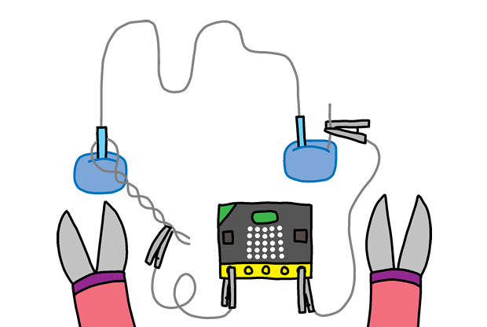

## Bouw je eigen spel

Nu we het spel geprogrammeerd hebben wordt het tijd om het echt te bouwen.

+ Eerst maken we de ring: neem een stuk koperdraad van ongeveer 20 cm en plooi het in het midden om zo een lus te maken.

+ Nu kan je de twee uiteinden strengelen.

+ Om de zenuwbaan zelf te maken: neem een ander stuk koperdraad van ongeveer 30 cm lang en buig het in een leuke vorm. 

+ Isoleer de uiteinden van de draad met elektrische tape.

+ Schuif nu de ring over de zenuwbaan en installeer die in de klei of het houtblok.

+ Je kan nu je zenuwbaan met de krokodilklemmen of een ander stukje koperdraad verbinden met je micro:bit.  
Verbind eerst de `ground` pin (GND) met een uiteinde van de baan.

+ Verbind nu pin 0 met het uiteinde van de stok met de ring. 

+ Test your game. Press button A and your score should be set to 0. Each time your wand touches the course, the circuit is completed and your micro:bit should add 1 to your number of fails.

+ Test je spel. Druk knop A in en je score moet op 0 komen te staan. Elke keer je de zenuwbaan raakt zou je micro:bit het aantal aanrakingen moeten verhogen.

## Uitdaging 1: Valsspelen
Kan je er voor zorgen dat als je knop B indrukt het aantal aanrakingen vermindert met 1?

## Uitdaging 2: Maak je eigen spel
Vraag een paar vrienden om je spel uit te proberen. Als het te gemakkelijk is kan je alles wat moeilijker proberen maken:

  + Maak een langer parcours
  + Voeg meer bochten toe in je parcours
  + Maak de ring aan het handvat kleiner
