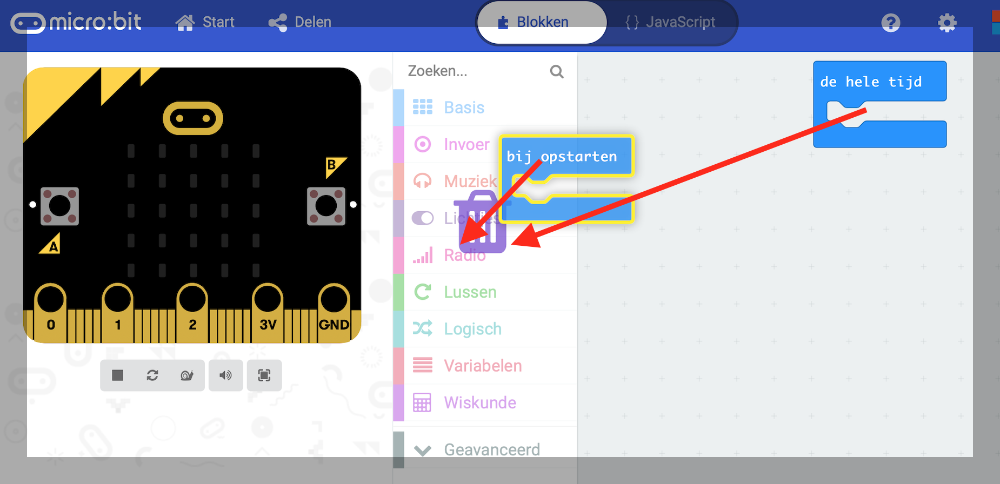
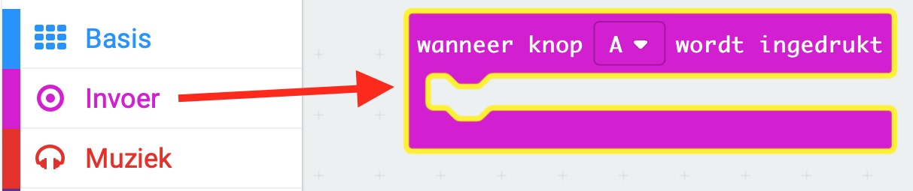
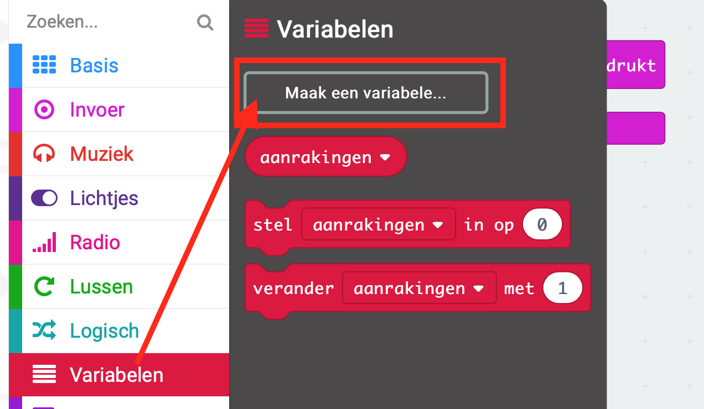
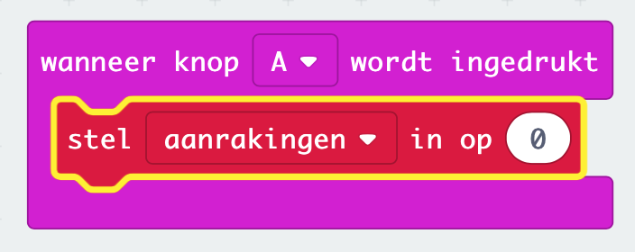
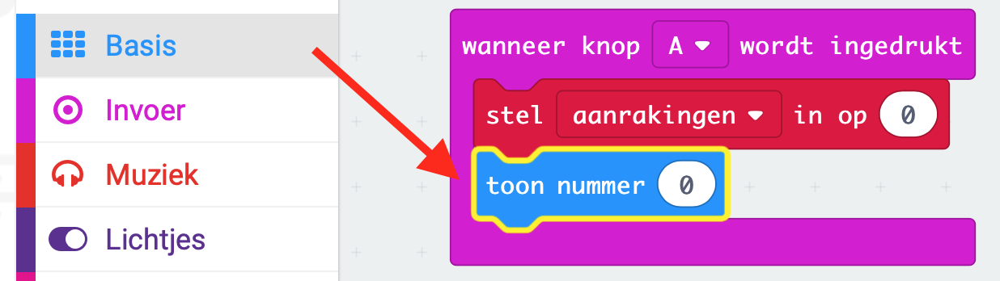
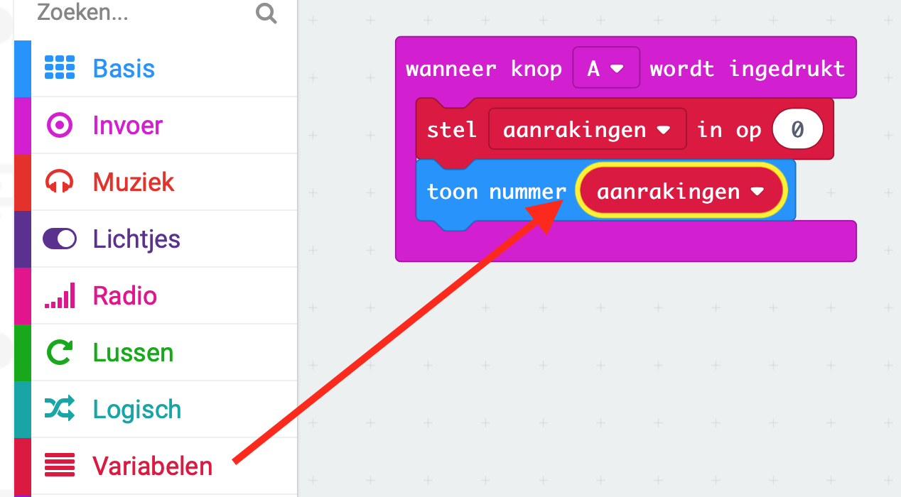

## Aanrakingen opslaan

We beginnen met het maken van een vakje waarin we het aantal aanrakingen kunnen bewaren.

+ Ga naar <a href="http://jumpto.cc/pxt-new" target="_blank">jumpto.cc/pxt-new</a> en begin een nieuw project in de MakeCode (PXT) omgeving. Noem je project 'Zenuwbaan'.

+ Verwijder de blokken `de hele tijd` en `bij opstarten` door ze naar het palet te slepen en in de prullenmand te gooien:  

+ Een nieuw spel start als de speler knop A indrukt. Kies 'Invoer' and dan `wanneer knop A wordt ingedrukt`.  

+ Nu heb je een variabele nodig om bij te houden hoeveel keer je tijdens het spel met de ring tegen de draad komt. Klik op 'Variabelen' en kies 'Maak een variabele...'. Noem de variabele `aanrakingen`.  

+ Sleep een `stel in` blok uit 'Variabelen' en selecteer `aanrakingen`.  
Dit zal het aantal aanrakingen op nul zetten wanneer je knop A indrukt.  

+ Nu kan je het aantal `aanrakingen` op je micro:bit tonen.  
Om dat te doen sleep je eerst `toon nummer` blok uit 'Basic' naar het einde van je script.  

+ Sleep dan `aanrakingen` uit 'Variabelen' op het `stel in` blok.  

	
+ Test nu je programma met de simulator. Als je op knop A klikt zou je het aantal aanrakingen moeten te zien krijgen, een aantal dat werd ingesteld op `0`.  

[>> Volgende: Een uitdaging](step_3.md)