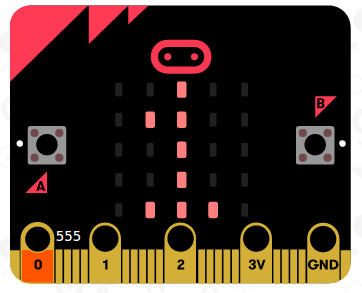
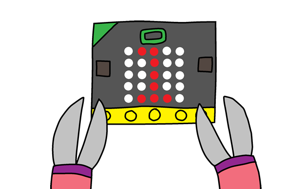

## Meerdere aanrakingen bijhouden

In deze stap zullen we het aantal aanrakingen die gebeuren bijhouden.

+ Je telt telkens 1 op bij de variabele `aanrakingen` wanneer via P0 verbinding wordt gemaakt. Om dit te doen, sleep je het blok `wanneer pin P0 wordt aangeraakt` uit 'Invoer'.  

+ Nu voeg je 2 blokken toe om 1 seconde lang een kruis te tonen als pin P0 verbieen signaal krijgt.  

+ Nu moet je nog 1 optellen bij de `aanrakingen` variabele. Daarvoor gebruik je het blok `verander aanrakingen met 1`.  

+ Tenslotte kunnen we een blok toevoegen dat de nieuwe waarde van het aantal `aanrakingen` toont op de micro:bit.  

+ Nu kan je testen. Druk op knop A in de simulator om het spel te starten. Telkens je op Pin P0 klikt zou je moeten zien dat je `aanrakingen` variabele met 1 vermeerdert.  

+ Klik nu op 'Downloaden' en installeer je programma op je micro:bit.  
Om de stroomkring te sluiten zet je je rechterduim op de aardingspin (GND) en raak je met je linkerduim pin P0 aan (0).  

[>> Volgende: Bouw je spel](step_4.md)